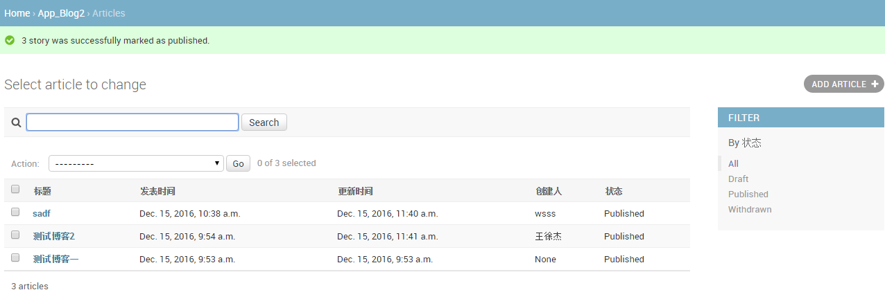

"# Python-Django"

- [x] 博客列表
- [x] 选择存储状态
- [x] 23code 软件列表

> 使用方式
>
> 1. 在23code/spider中 执行`python 23code.py` 会自动抓去数据
> 2.  根目录 ` python manage.py runserver 0.0.0.0:8000`
> 3. 打开浏览器 访问 `http://127.0.0.0/admin`

* 示例一

* 示例二

